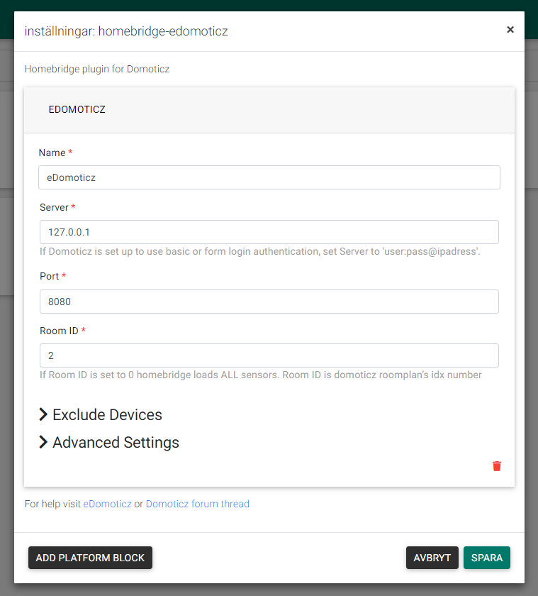

# Homebridge-eDomoticz
This is a plugin for [Homebridge](https://github.com/nfarina/homebridge) and [Homebridge Config UI X Support](https://github.com/oznu/homebridge-config-ui-x) and [Domoticz](https://github.com/domoticz/domoticz).

## Supports:
<details>
<summary><b>Standard HomeKit Types (supported by Home.app):</b></summary>
    
- Sockets (on/off)
- Lamps (on/off)
- Contact Sensors
- Blinds
- Smoke Detectors
- Blinds (inverted)
- Lamps (dimmer)
- Motion Sensors
- Push Switches
- Lock Contact
- Blinds (%)
- Blinds (& inverted)
- Push Buttons (selectors)
- Lock Mechanisms
- Lock Mechanisms (inverted)
- Temperature sensors (only temperature characteristic in case of T+H / T+H+B)
- Thermostat SetPoints
</details>

## Provides:
<details><summary><b>Custom HomeKit Types (supported by 3rd Party HomeKit Apps only - eg: Elgato Eve):</b></summary>
    
- General kWh power meters - Types: General, Current; SubType: kWh, mapped to Eve chars where possible
- General Current, Voltage - Types: General, SubType: Current,Voltage, mapped to Eve chars where possible
- CurrentCost USB power meter - Type: Usage, SubType: Electric, mapped to Eve chars where possible
- P1 Smart Meter (Electric & Gas), mapped to Eve chars where possible
- EvoHome** / OpenTherm Thermostat support - Types: Heating, Thermostat; SubTypes: Zone, SetPoint
- YouLess Meter (Current, Total and Today Total Consumption) - Type: YouLess Meter; SubType: YouLess counter, mapped to Eve chars where possible
- General Usage % meters (eg: Motherboard Sensors Hardware Device - CPU %, Mem %, HDD % etc) - Type: General; SubType: Percentage
- Temperature, Temp + Humidity, Temp + Humidity + Baro (Current Temperature, Current Humidity, Current Pressure in hPA) - Type: Temp, Temp + Humidty, Temp + Humidity + Baro [id'd as Eve Weather]
- DarkSkies Virtual Weather Station Sensors (Wind, Solar Radiation, Rainfall, Visibility, Barometer [id'd as Eve Weather])

** assumes the EvoHome has been setup according to [this script method](https://www.domoticz.com/wiki/Evohome#Scripting_for_RFG100).
</details>

## Installation

**Option 1: Install via Homebridge Config UI X:**

 1. Navigate to the Plugins page in in [homebridge-config-ui-x](https://github.com/oznu/homebridge-config-ui-x).
 2. Search for "domoticz" and install homebridge-edomoticz.

**Option 2: Manually Install:**
```
sudo npm install -g homebridge-edomoticz
```

## Update

**Option 1: Update via Homebridge Config UI X:**

 1. Navigate to the Plugins page in [homebridge-config-ui-x](https://github.com/oznu/homebridge-config-ui-x).
 2. Click the Update button for the eDomoticz plugin.

**Option 2: Manually Update:**
```
sudo npm update -g homebridge-edomoticz
```

## Configuration

To configure homebridge-eDomoticz you must also be running [homebridge-config-ui-x](https://github.com/oznu/homebridge-config-ui-x).

 1. Navigate to the Plugins page in homebridge-config-ui-x.
 2. Click the Settings button for the eDomoticz plugin.
 
 
 
### Manual Settings

<details><summary><b>Manual Configuration</b></summary>

~/.homebridge/config.json example:
```js
{
    "bridge": {
        "name": "Homebridge",
        "username": "CC:21:3E:E4:DE:33",
        "port": 51826,
        "pin": "031-45-154"
    },
    "platforms": [
        {
            "platform": "eDomoticz-ui-x",
            "name": "Domoticz",
            "server": "127.0.0.1",
            "port": "8080",
            "ssl": false,
            "roomid": 0,
            "mqtt": true,
            "debuglog":false,
            "excludedDevices": [],
            "dimFix": 0
        }
    ],
    "accessories": []
}
```
To prevent certain Domoticz devices from showing up in HomeBridge it is possible to exclude them by setting the "excludedDevices" parameter.
Provide an array of Domoticz Device IDX's, which can be found in the Domoticz dashboard on the "Setup > Devices" page and look for the "idx" column.

```js
"excludedDevices": ["12","30","129"]
```

The dimFix variable relates to an early issue between HomeKit and Domoticz regarding scaling of dimmer values. These days, for the majority of setups this variable can be set to 0 or omitted entirely. If you find that you can never set your dimmers to 100%, then set this variable to 1. If you find that, when you set your dimmers, this starts a never ending loop of brightness increasing by 1%, then you MUST omit this variable or set it to 0.
```js
"dimFix": 0
```

</details>

<details><summary><b>Advanced Configuration</b></summary>

### MQTT
By default, the plugin will grab hardware information regarding MQTT from Domoticz if `mqtt` is 1 or true in the configuration file.
Advanced users can override their MQTT configuration as follows:

```js
"mqtt": {
  "host": "alternate.mqtt.com",
  "port": 1234,
  "topic": "domoticz/out",
  "username": "username",
  "password": "password"
}
```

Values can be omitted from this dictionary, and the values that need overriding can be kept, e.g.

```js
"mqtt": {
    "port": 1234
}
```

to only override the port value.

### SSL
Set "ssl":1 or true in config.json to turn on SSL (ie: server connects with https:// rather than http://). You will need to specify your SSL port - usually "port":"443" by default.

</details>

## Tips

### Authentication
If Domoticz is set up to use basic or form login authentication, set "server":"user:pass@ip" within config.json. The plugin will internally extract the username and password, base64 encode it and send it as a http authorization header whenever it talks to your Domoticz server.

### Issues pairing to Homebridge when you have a lot of Domoticz sensors...
If you have more than 99 devices in Domoticz, you need to limit the number of devices exposed to HomeKit (Homebridge only supports 99 Accessories on a single bridge - whilst we could combine multiple sensors into a single homekit accessory within the plugin, the possible combinations out there are endless, so we won't).

Therefore, to reduce the number of devices exposed from Domoticz, create a roomplan within Domoticz via Setup > More Options > Plans > roomplan. Add only the devices you wish to be exposed to HomeKit to this new roomplan within Domoticz, and then get it's roomidx number. Set "roomid" in your config.json file to this room number.

### Is my device supported??
See [Domoticz API Reference](https://www.domoticz.com/wiki/Domoticz_API/JSON_URL's#Retrieve_status_of_specific_device) - query your device as per the instructions there, and if your device’s SwitchTypeVal isn't in the 'Supports:' list or Type/SubType aren’t in the ’Provides:' list above then it'll just appear as an On/Off switch. [Open a new issue](https://github.com/PatchworkBoy/homebridge-edomoticz/issues/new) including the output from the json api and I’ll get look into supporting that particular device more fully!

### What does the Override slider represent on the EvoHome Thermostat?
Override-Until time in minutes from the current time. Allows setting an override-until time upto 8 hours in the future. Setting this slider to 0 will set the heating mode to Auto. Setting it to 481 will set the override as a PermanentOverride.

### Logging
Complies with Homebridge's native logging & debugging methodology - see https://github.com/nfarina/homebridge/wiki/Basic-Troubleshooting
